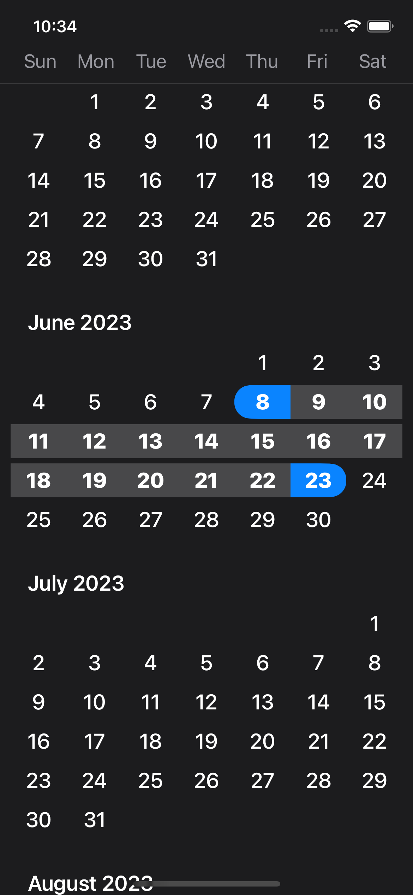
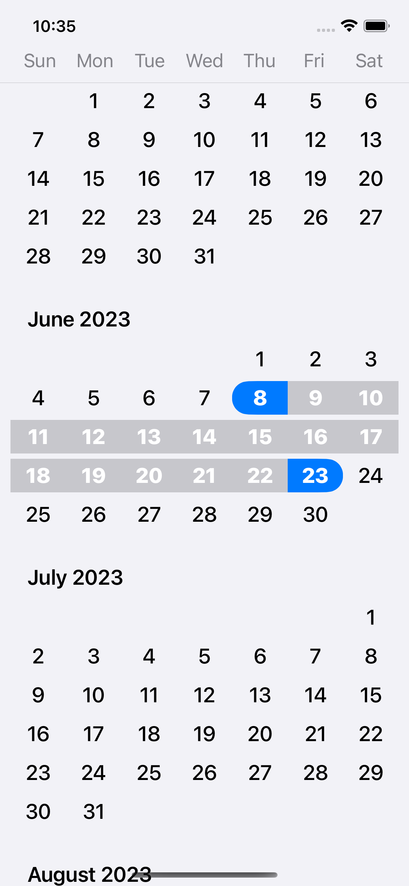

# RangeCalendarSwiftUI

### Simple range of dates calendar for SwiftUI.

- Range of dates
- Color customization
- Minimum and maximum dates selectable
- Light and dark mode

## 📷 Screenshots 

 <div align="center">
 
 
  </div>
  
## 🖥️ Installation
### Requirements
- iOS 14 or iPadOS 14
- Xcode 13+ and Swift 5.3
- No MacOS, and WatchOS support

### Install
Swift Package Manager (Recommended)
You can install RangeCalendarSwiftUI into your Xcode project via SPM.
For Xcode 13, navigate to Files → Add Package
Paste the repository URL (https://github.com/BogdanZyk/RangeCalendarSwiftUI)
  
# 🛠️ Usage

 Simple default use set the maximum and minimum dates for their display

```swift

import RangeCalendar

struct ContentView: View {
    
    @StateObject var manager = RCManager(
        calendar: Calendar.current,
        minimumDate: Date.now,
        maximumDate: Date().addingTimeInterval(60*60*24*365))
    
    var body: some View {
        RangeCalendar(manager: manager)
    }
}

```

If you need to adjust the colors:

```swift
 RangeCalendar(manager: manager)
            .onAppear{
                manager.colors.textColor = .blue
                manager.colors.weekdayHeaderColor = .secondary
                manager.colors.todayColor = .yellow
                manager.colors.betweenStartAndEndBackColor = .green
            }


```

If you need to set end and start dates:

```swift
@StateObject var manager = RCManager(
    calendar: Calendar.current,
    minimumDate: Date.now,
    maximumDate: Date().addingTimeInterval(60*60*24*365),
    startDate: Date().addingTimeInterval(60*60*24*26),
    endDate: Date().addingTimeInterval(60*60*24*35))
```


### License
RangeCalendarSwiftUI is created by BogdanZyk and licensed under the [License MIT](https://opensource.org/licenses/MIT)


